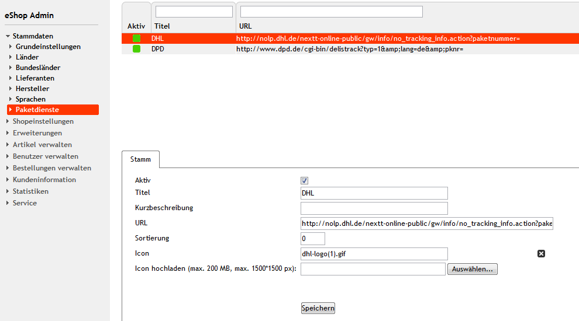
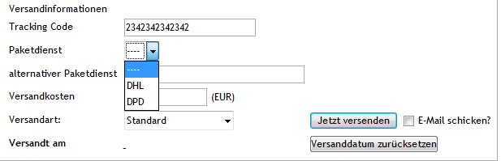
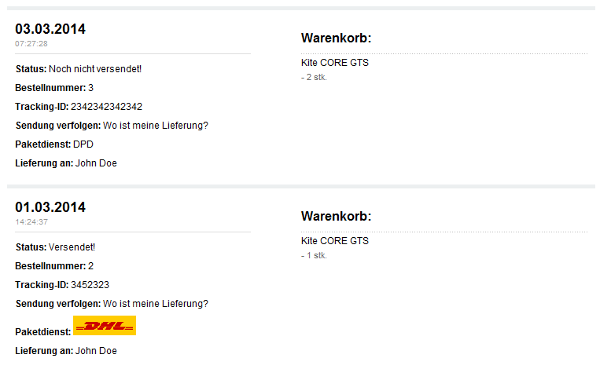

carrier_tracking
================
DE:
Eine einfache Verwaltung von Paketdiensten und deren Trackingsm&ouml;glichkeiten. 
Damit k&ouml;nnen beliebige viele Dienstleister im Shop angelegt werden und inviduell jeder Bestellung als Versender und damit als Trackingurl hinterlegt werden.

Author der Version 1.0 kann nicht mehr genau ermittelt werden(vermutlich eine Praktikumsarbeit bei Oxid).

---------------------
EN:
A simple package management of services and their tracking capabilities. 
This allows any number of service providers are created in the shop and inviduell every order be so deposited as senders and as Trackingurl.

Author version 1.0 can not be accurately determined (probably a practical work at Oxid)

----

----

Originally posted in August 2010:
https://projects.oxidforge.org/projects/carriertracking

